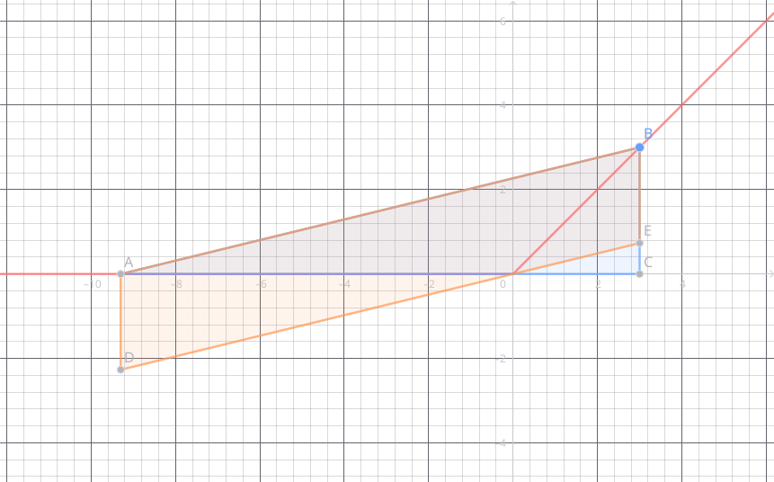

# Zonotope and Polytope

## Zonotope

If the linear functions always have symmetric bounds, in the end, the area from the propagation forms a zonotope. For non-linear operator $f$, suppose we have the following bounds:

$$
𝐚 \odot 𝐱 + 𝐥𝐛 ≤ f(𝐱) ≤ 𝐚 \odot 𝐱+ 𝐮𝐛
$$

It can be represented as:

$$
\begin{gathered}
f(𝐱) = 𝐚 \odot 𝐱 + \frac{𝐮𝐛 + 𝐥𝐛}{2} + \frac{𝐮𝐛 - 𝐥𝐛}{2} \boldsymbol{\epsilon} \\
\text{where } \boldsymbol{\epsilon} ∈ [-1, 1]
\end{gathered}
$$

Propagating through entire network, the output of the entire network has the following form:

$$
\mathcal{N}(𝐱) = W \boldsymbol{\epsilon} + \boldsymbol{b}
$$

The upperbound and lowerbound can be computed as:

$$
\boldsymbol{b} - |W| \mathbf{1} ≤ \mathcal{N}(𝐱) ≤ \boldsymbol{b} + |W| \mathbf{1}
$$

## Polytope

If the bounds are not always symmetric, the area from the propagation forms a polytope. For non-linear operator $f$, suppose we have the following bounds:

$$
𝐥 \odot 𝐱 + 𝐥𝐛 ≤ f(𝐱) ≤ 𝐮 \odot 𝐱 + 𝐮𝐛
$$

<!-- Similar to Zonotope, it can be represented as:

$$
\begin{gathered}
f(𝐱) = \frac{𝐮+ 𝐥}{2} \odot 𝐱 + \frac{𝐮𝐛 + 𝐥𝐛}{2} + \left(\frac{𝐮 - 𝐥}{2} \odot 𝐱 + \frac{𝐮𝐛 - 𝐥𝐛}{2} \right)\boldsymbol{\epsilon}\\
\text{where } \boldsymbol{\epsilon} ∈ [-1, 1]
\end{gathered}
$$ -->

However, the output of the entire network cannot be represented as a simple linear function of $\boldsymbol{\epsilon}$. To find the upperbound and lowerbound, we need to solve the following optimization problem:

$$
\begin{gathered}
\text{max/min } 𝐱_n \\
𝐥_i \odot W_i 𝐱_i + 𝐥𝐛_i ≤ 𝐱_{i+1} ≤ 𝐮_i \odot W_i 𝐱_i + 𝐮𝐛_i \\
\text{where }i = 0, 1, ..., n-1 \\
\end{gathered}
$$

A simple approach can be used to solve this optimization problem. Specifically, we propagate the bounds from the output layer to the input layer. As an example, the optimization problem:

$$
\begin{gathered}
\text{max } 𝐚^⊤ 𝐱_n \\
𝐥_i \odot W_i 𝐱_i + 𝐥𝐛_i ≤ 𝐱_{i+1} ≤ 𝐮_i \odot W_i 𝐱_i + 𝐮𝐛_i \\
\text{where }i = 0, 1, ..., n-1 \\
\end{gathered}
$$

Are reduced to:

$$
\begin{gathered}
\text{max } 𝐚^⊤ (\boldsymbol{\lambda}_{n-1} \odot W_{n-1} 𝐱_{n-1} + \boldsymbol{\mu}_{n-1}) \\
𝐥_i \odot W_i 𝐱_i + 𝐥𝐛_i ≤ 𝐱_{i+1} ≤ 𝐮_i \odot W_i 𝐱_i + 𝐮𝐛_i \\
\begin{aligned}
\text{where } &i = 0, 1, ..., n-2 \\
&\boldsymbol{\lambda}_{n-1} = \text{ite}(𝐚 ≥ 0, 𝐮_{n-1}, 𝐥_{n-1}) \\
&\boldsymbol{\mu}_{n-1} = \text{ite}(𝐚 ≥ 0, 𝐮𝐛_{n-1}, 𝐥𝐛_{n-1}) \\
\end{aligned} \\
\end{gathered}
$$

This process is done by replacing the optimization variable $𝐱_n$ with its upperbound or lowerbound, depending on the sign of the coefficient $𝐚$. We can repeat this process until we reach the input layer, and we can find the upperbound and lowerbound of the output layer.

## Comparison

### Similarity

1. Both the two methods have the same time complexity of $O(n^2 M)$, where $n$ is the number of layers, $M$ is the time cost by matrix multiplication. 
2. Zonotopes can be computed through backward propagation. Thus, polytope can be seen as a generalization of zonotope.

### Advantage of Zonotope

1. Zonotope is symmetric w.r.t. negation, which means that if we have the upper bounds of $\boldsymbol{b} + |W| \mathbf{1}$, we can easily find the lower bounds as $\boldsymbol{b} - |W| \mathbf{1}$. However, due to the asymmetry of polytope, we cannot easily find the lower bounds from the upper bounds. This makes zonotope solutions are at least twice as fast as polytope solutions.
2. In practice, zonotope-based methods can have more optimization for special non-linear functions like ReLU. If ReLU is linear in the input area, we can directly propagate the bounds without introducing new error terms. For polytope-based methods, similar things could be done, but the process is more complicated and less efficient.

### Advantage of Polytope

1. The bounds of polytope will be tighter in certain cases:

    

    Also available at https://www.geogebra.org/calculator/jkvhsncn.
2. We can also view polytope bounds as two zonotope bounds:

    $$
    \begin{gathered}
    𝐥 \odot 𝐱 + 𝐥𝐛 ≤ f(𝐱) ≤ 𝐥 \odot 𝐱 + 𝐮𝐛_\text{new} \\
    𝐮 \odot 𝐱 + 𝐥𝐛_\text{new} ≤ f(𝐱) ≤ 𝐮 \odot 𝐱 + 𝐮𝐛
    \end{gathered}
    $$

    This way, in the propagation of upperbound, we can use the corresponding zonotope bounds $𝐥𝐛_\text{new}$ and $𝐮𝐛_\text{new}$ to obtain a computation-free lower bound. However, I didn't see anybody use this bound.

