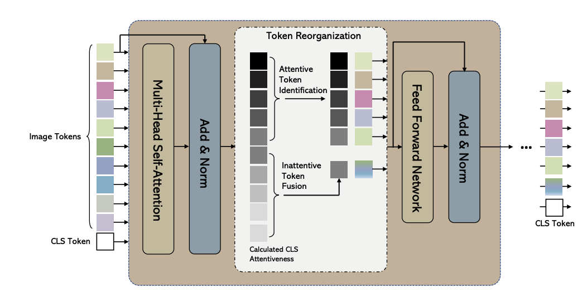
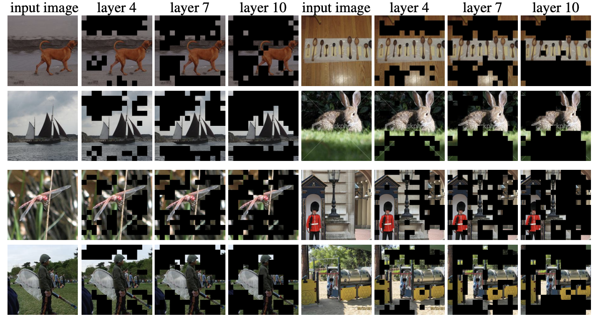

# [Not All Patches are What You Need: Expediting Vision Transformers via Token Reorganizations](https://ar5iv.labs.arxiv.org/html/2202.07800)

## Token reorganizations

### ViT Overview

* ViT perform tokenization by dividing an input image into patches and projecting each patch to a token embedding.
* An extra class token `[CLS]` is added to the set of image tokens and is responsible for aggregating global image information and final classification.
* Positional embeddings are represented as learnable vectors added to the token embeddings to encode spatial information.
* At the final Transformer encoder layer, the [CLS] token is extracted and utilized for object category prediction. 

### Attentive token identification

In Vit, transformer, the attention score between the [CLS] token and other tokens is computed as follows:

$$
x_\text{class} = \text{softmax}\left(\frac{q_\text{class} K^T}{\sqrt{d}}\right) V = a \cdot V
$$

> Since  $𝒗_i$ comes from the $i$-th token, the attention value $a_i$ (i.e., the $i$-th entry in $𝒂$) determines how much information of the $i$-th token is fused into the output of [CLS] (i.e., 
$𝒙_\text{class}$)through the linear combination. It is thus natural to assume that the attention value $a_i$ indicates the importance of the $i$-th token.

> Moreover, Caron et al. (2021) also showed that the [CLS] token in ViTs pays more attention (i.e., having a larger attention value) to class-specific tokens than to the tokens on the non-object regions. To this end, we propose to use the attentiveness of the [CLS] token with respect to other tokens to identify the most important tokens.

> Based on these arguments, a simple method to reduce computation in ViT is to remove the tokens with the smallest attention values. 

> In multi-head self-attention layer, there are multiple heads performing the computation of Eq. 1 in parallel. Thus, there are multiple [CLS] attention vectors being the total number of attention heads. We compute the average attentiveness value of all heads.

### Inattentive token fusion

> Although the tokens on the backgrounds of images are less informative and can be discarded without significantly influencing the performance of the ViT model, they may still be able to contribute to the prediction results. On the other hand, some images may have large object parts covering a large proportion of the images. 

> To mitigate these problems, we propose to fuse the inattentive
tokens at the current stage to supplement attentive ones:

$$
x_\text{fused} = \sum_{i\in \mathcal{N}}a_i x_i
$$

## Experiments

