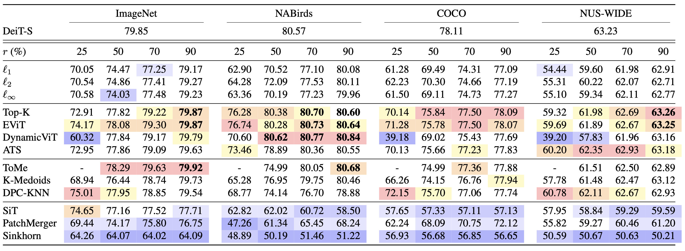

# [Which Tokens to Use? Investigating Token Reduction in Vision Transformers](https://ar5iv.labs.arxiv.org/html/2308.04657)

## Introduction

The limitation of existing methods:

> However, with some limited exceptions, little has been done to gain deeper insights into how the token reduction process differs across methods or depends on hyperparameters such as backbone capacity or the number of tokens to be kept.

> Furthermore, the analysis of methods have primarily been constricted to the ImageNet dataset, and is rarely done with structured comparisons to other methods.

Contributions:

> We conduct the first systematic comparison and analysis of 10 state-of-the-art token reduction methods across four image classification datasets, trained using a single codebase and consistent training protocol.

> We find that the Top-K and EViT methods are strong baselines across all datasets.

> Extensive experiments providing deeper insights into the core mechanisms of the token reduction methods.

> We find that the similarity in reduction patterns is a moderate-to-strong proxy for model performance.

## Related Works

* Token Pruning: aim to reduce the token sequence by removing tokens
    * Static Keep Rate Methods: Based on a fixed keep rate, using ranking to determine which tokens to keep
    * Dynamic Keep Rate Methods: An adaptive keep rate, the methods include sampling, reinforcement learning, or alternating training.
* Token Merging: reduce the token sequence by combining tokens
  * Hard Merging: Harder Clustering
    * Clustering: K-Means, K-Medoids, and Density-Peaks Clustering
    * Other Methods: Bipartite Matching (ToMe).
  * Soft Merging: Soft Clustering

## [List of Methods](https://ar5iv.labs.arxiv.org/html/2308.04657#:~:text=keep%20rate.-,3.1,Methods,-To%20ensure%20diversity)

Let $P$ be the number of spatial tokens, $s$ is the number of reduction stages, $r$ is the reduction ratio, $P_s$ and $K_s$ are the number of input and output spatial tokens in each layer, respectively.

1. Fixed Pattern Pruning Baseline: 
    * a fixed reduction pattern based on the distance of each token to the center of the image, measured using the $l_1$, $l_2$, or $l_\infty$ norm.
    * Minimize $| \#\text{kept-tokens} - P r^s|$.
2. Static Keep Rate Pruning
    1. Top-K: 
        * Attention between the $P$ spatial tokens and the CLS token is used. 
        * Selects the $K_s$ most attended to tokens, where $K_s = P r^s$.
    2. [EViT](https://ar5iv.labs.arxiv.org/html/2202.07800):
        * Extends Top-K pruning by creating a single "fused" token at each stage $s$.
        * The fused token is computed by averaging the pruned tokens at each stage.
    3. [DynamicViT](https://arxiv.org/pdf/2106.02034):
        * Prunes the tokens by constructing a binary decision mask $𝐃_s$ based on keep probabilities produced by a small prediction module.
        * The Gumbel-Softmax trick is used to ensure training is differentiable.
        * While during inference the $K_s$ most probable tokens are kept. An extra loss is needed to ensure that $𝐃_s$ only keeps $K_s$ tokens. (Equation (15) of the original papaper).
3. Dynamic Keep Rate Pruning
    1. [ATS](https://ar5iv.labs.arxiv.org/html/2111.15667):
        * Sampling-based pruning method.
        * achieved by applying the inverse transform sampling (ITS) on the cumulative distribution function (CDF) of the CLS token attention scores and uniformly sampling the CDF $P r^s$ times. 
        * In case a token is assigned a high attention score by the CLS token it may be sampled multiple times by the ITS operation.
        
4. Hard Merging
    1. [ToMe](https://ar5iv.labs.arxiv.org/html/2210.09461):
        * the set of tokens are split into a bipartite graph with equal sized partitions $A$ and $B$, where an injective function from $A$ to $B$ is defined by the node in $B$ with the highest cosine similarity.
        * Each node in $A$ with The $P_s(1 -r^s)$ highest value is merged with its corresponding node in $B$ by averaging their features, and the resulting merged token is assigned to the node in $B$.
        
    2. [K-Medoids](https://openaccess.thecvf.com/content/WACV2023/papers/Marin_Token_Pooling_in_Vision_Transformers_for_Image_Classification_WACV_2023_paper.pdf):
        * Iterative clustering algorithm where $P r^s$ cluster centers are set to be the cluster element which minimizes the $l_2$ distance to all other elements in the cluster.
        * The method iteratively updates the clusters by assigning tokens to the cluster with the closest cluster center. 
        * The method is initialized using the top-$P r^s$ tokens with the highest attention scores to the CLS token.
    3. [DPC-KNN](https://www.sciencedirect.com/science/article/abs/pii/S0950705116000794) (Density-Peak Clustering with K-Nearest Neighbours):
        * A two-step clustering approach that identifies cluster centers via density and proximity metrics.
        * First, compute the local density $\rho_i$ for each token based on its K-nearest neighbours.
        * Second, compute the distance $\delta_i$ to the nearest token with higher density.
        * Cluster centers are tokens with high $\rho_i \cdot \delta_i$ values.
        * Supports weighted averaging of tokens within each cluster.
5. Soft Merging
    1. SiT (Self-slimmed Vision Transformer):
        * A small network predicts an assignment matrix $\mathbf{A}_s \in \mathbb{R}^{Pr^{s-1} \times Pr^s}$.
        * Output $X_s = X_{s-1} \mathbf{A}_s$, where $X_{s-1}$ is the input token sequence.
    2. Sinkhorn:
        * Query-based clustering method, unlike in SiT, the cluster centers, called queries, are randomly initialized learnable vectors.
        * The assignment matrix is constructed by applying the Sinkhorn-Knopp algorithm on the cosine similarities between the tokens and queries.
    3. PatchMerger:
        * Query-based clustering similar to Sinkhorn.
        * The assignment matrix is constructed via the dot product between queries and tokens, followed by softmax normalization.

## Datasets

> ImageNet is the most commonly used vision classification dataset, consisting of 1000 diverse classes across 1.2 million images. 

> In contrast, the NABirds dataset represents a much more fine-grained classification task, consisting of 48,000 images and 555 bird classes

> COCO and NUS-WIDE consists of 80–81 classes of common object and animals across 122k to 220k images, respectively. 

> In contrast to ImageNet, where the object of interest is often in the center of the image, the NABirds, COCO, and NUS-WIDE represent scenarios where the distinguishing attributes are not necessarily in the center of the image, or there may be more than one object of interest, respectively.

## Results

> Performance of Token Reduction methods with DeiT-S backbone. Model performance is measured across varying keep rates, $r$, denoted in percentage of tokens kept at each reduction stage. Scores exceeding the DeiT baseline are noted in bold, measured in Top-1 accuracy for ImageNet & NABirds and mean Average Precision for COCO & NUS-WIDE. The three best performing methods per keep rate are denoted in descending order with red, orange, and yellow, respectively.

> Comparatively, with a keep rate of 50-90% the Top-K method is the best performing method 36% of the time and in the top-3 methods 83% of the time. [This contradicts previous results](https://ar5iv.labs.arxiv.org/html/2111.15667#:~:text=(a),left), and indicates that the Top-K method is a very strong baseline. 

> However, at a keep rate of 25% we find that the fused tokens in the EViT method can lead to an improvement of up to 2 percentage points over the Top-K method.

> Lastly, we note that when 90% of tokens are kept, the Top-K, EViT, DynamicViT, ATS, and ToMe methods outperform the DeiT baselines by up to 0.5 percentage points.

## In-Depth Analysis

### Are Reduction Patterns Consistent when Varying the Keep Rate $r$?

> From this we can conclude that pruning-based methods, with the exception of ATS, produce consistent reduction patterns when varying $r$. Similarly, we find that the hard-merging methods select consistent clusters, but with inconsistent cluster centers, while soft-merging methods produce inconsistent clusters when varying $r$.

### Are Reduction Patterns Consistent when Varying Model Capacity?

> From this we can conclude that the reduction patterns of pruning-based methods are inconsistent when varying the backbone capacity. For merging-based methods we find that the ToMe, DPC-KNN, and K-Medoids methods are consistent as long as $r>25%$, while PatchMerger is consistent for $r>50%$. We can again conclude that the hard-merging methods select consistent clusters, but with varying cluster centers, while soft-merging methods produce inconsistent clusters, as was observed in Section 5.1.

### Do Reduction Patterns Differ Across Datasets?

> We find a moderate-to-high correlation of the averaged reduction patterns for nearly all methods across all datasets and keep rates. The exceptions are the DPC-KNN, K-Medoids, and DynamicViT methods, which are found to have spurious lower (but still positive) correlation scores for several dataset pairs, indicating the averaged reduction patterns are less consistent.

### Do Pruning-based Reduction Patterns Differ from Fixed Patterns?

> We find that all learned pruning-based reduction patterns have a very low IoU with the fixed $ℓ_p$ patterns at all reduction stages

### Are Reduction Patterns Good Proxies for Model Performance?

> We find that for all model capacities the orthogonal Procrustes distance and NMI are highly correlated with the difference in model performance, while the IoU metric is moderately correlated.