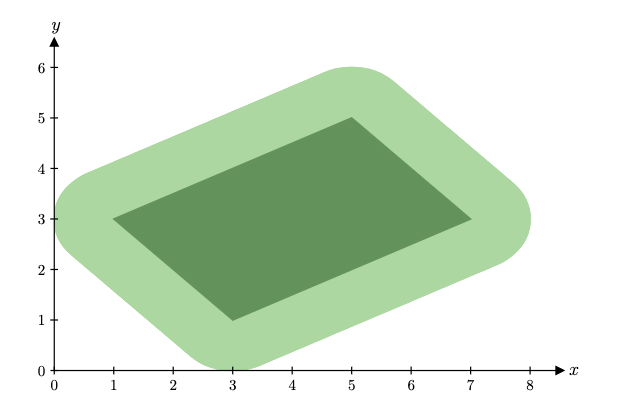
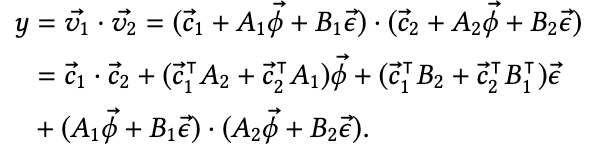
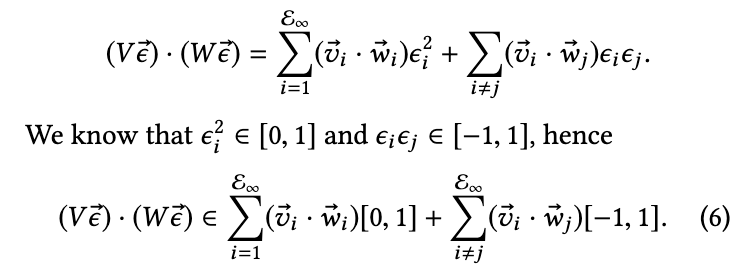

# DeepT

Paper: https://files.sri.inf.ethz.ch/website/papers/pldi21-transformers.pdf

Code: https://github.com/eth-sri/DeepT

## Multinorm Zonotope

DeepT uses a more general form of zonotope, called multinorm zonotope, to represent the reachable set of each layer, which added a $p$-norm term to the original zonotope:

$$
\begin{gathered}
\mathcal{N}(𝐱) = W_1 \boldsymbol{\phi} + 
 W_2 \boldsymbol{\epsilon} + \boldsymbol{b} \\
\text{where } \boldsymbol{\epsilon} ∈ [-1, 1]^m \text{ and } \|\boldsymbol{\phi}\|_p ≤ 1 \\
\end{gathered}
$$

However, this new term is only created at the input of the network. Linearization of non-linear operator only creates the original zonotope term. 
So mostly, we still consider DeepT as a zonotope-based method. 

## Dual Norm

Notably, the upperbound and lowerbound have a unified form:

Retain the above notation. The tight lower and upper bounds of $𝐳 \cdot 𝐱$ where $𝐱 ∈ \mathbb{R}^N$ s.t. $∥𝐱∥_p ≤ 1$ are given by

$$
−∥𝐳∥_q ≤ 𝐳 \cdot 𝐱 ≤ ∥𝐳∥_q \text{ where } \frac{1}{p} + \frac{1}{q} = 1
$$

## Dot Product Abstract Transformer

### DeepT-Fast

Assume $\phi$ has norm $p$ and $\boldsymbol{\epsilon}$ has norm $\infty$, $1/p+1/q=1$:

$$
\begin{aligned}
&\left|(V\boldsymbol{\phi})^⊤ (W \boldsymbol{\epsilon})\right| \\
=&\left|(\boldsymbol{\phi}^⊤ 𝐯_1) (w_1^⊤ \boldsymbol{\epsilon}) +
(\boldsymbol{\phi}^⊤ 𝐯_2) (w_2^⊤ \boldsymbol{\epsilon})\right| \\
≤& \;|\boldsymbol{\phi}^⊤ 𝐯_1| |w_1^⊤ \boldsymbol{\epsilon}| +
|\boldsymbol{\phi}^⊤ 𝐯_2| |w_2^⊤ \boldsymbol{\epsilon}| \\
≤& \;|\boldsymbol{\phi}^⊤ 𝐯_1| \|w_1\|_1 + |\boldsymbol{\phi}^⊤ 𝐯_2| \|w_2\|_1 \\
=& \;|𝐯_1^1 \phi_1 + 𝐯_1^2 \phi_2| \|w_1\|_1 + |𝐯_2^1 \phi_1 + 𝐯_2^2 \phi_2| \|w_2\|_1 \\
≤& \;(|𝐯_1^1| |\phi_1| + |𝐯_1^2| |\phi_2|) \|w_1\|_1 + (|𝐯_2^1| |\phi_1| + |𝐯_2^2| |\phi_2|) \|w_2\|_1 \\
≤& \left\| \begin{pmatrix} |𝐯_1^1| \|w_1\|_1 + |𝐯_2^1| \|w_2\|_1 \\
|𝐯_1^2| \|w_1\|_1 + |𝐯_2^2| \|w_2\|_1 \end{pmatrix} \right\|_q
\end{aligned}
$$

### DeepT-Precise

## Softmax Abstract Transformer

### Softmax Sum Zonotope Refinement

DeepT has special way to make sure the sum of the output of the softmax is 1. 

1. computing a refined variable y′1 by imposing the equal-ity constraint $y_1 = 1 − (y_2 + \cdots + y_N)$
2. refining all other variables $y_2, \cdots , y_N$ to $y′_2, \cdots, y′_N$
by imposing bounds derived from $y_1' + y_2' + \cdots + y_N' = 1$
3. tightening the bounds of the $ϵ_i$’s to a subset of $[−1, 1]$

## LayerNorm?

DeepT does not use division in the LayerNorm.